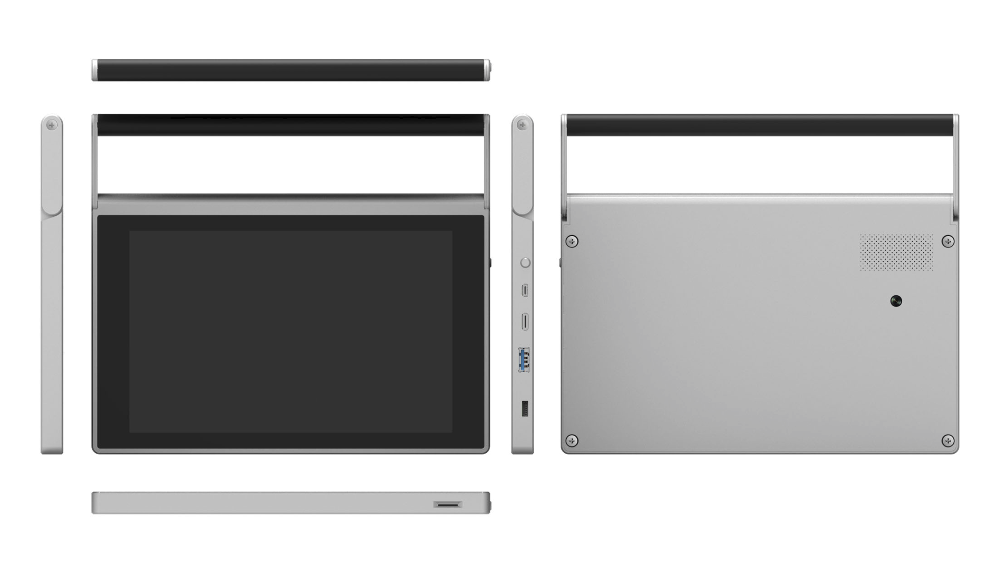

## Enclosure Design for CutiePi tablet

This repository hosts CutiePi tablet related enclosure design, including FDM printable STL files, and eventually final designs for the injection molds. 

 

### 3D Printable STL Files

- Front Bazel * 1 - [Bezel.stl](STL/Bezel.stl)
- Chassis * 1 - [Chassis.stl](STL/Chassis.stl)
- Hinge * 2 - [Hinge.stl](STL/Hinge.stl)
- Handle * 1 - [Handlle.stl](STL/Handle.stl) 

All printed with 0.2mm layer high, 25% infill rate, with support. 

### Design Files 

Check out the [STP](STP folder) for STEP files. 

### Copyright & License 

Ping-Hsun "penk" Chen &lt;[penk@cutiepi.io](mailto:penk@cutiepi.io)&gt;

Creative Commons license: Attribution-ShareAlike 4.0 International (CC BY-SA 4.0)