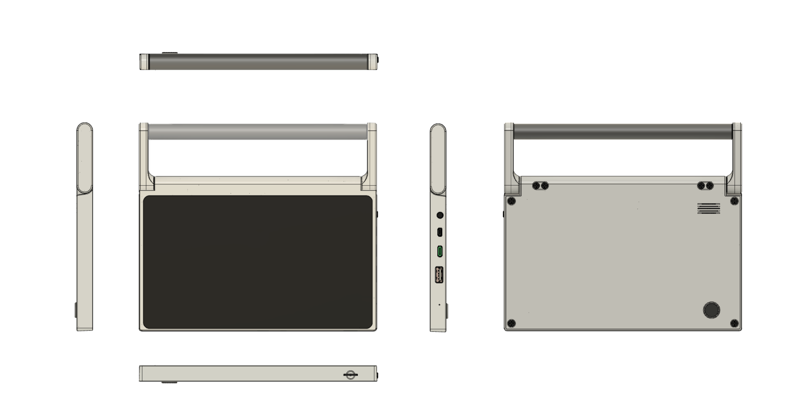

## Enclosure Design for CutiePi tablet

This repository hosts CutiePi tablet related enclosure designs, consisting 3D printable STL files and editable STEP files for the final injection mold design. 

 

### 3D Printable Files

- [Chassis](STL/CutiePi-chassis.stl) * 1
- [Cover](STL/CutiePi-back-cover.stl) * 1 
- [Hinge](STL/CutiePi-hinge-bottom.stl) * 2 
- [Hinge cap](STL/CutiePi-hinge-top) * 2 
- [Handle](STL/Handle.stl) * 1 
- [Power switch](STL/CutiePi-power-switch.stl) * 1 
- [Camera lens](STL/CutiePi-camera-lens.stl) * 1 

All parts printed and tested on FDM printers with 0.2mm layer high, and 25% infill rate. 

### Editable Design File 

Check out the [STP folder](https://github.com/cutiepi-io/cutiepi-enclosure/tree/master/STP) for STEP file. 

### Copyright & License 

Penk Chen &lt;[penk@cutiepi.io](mailto:penk@cutiepi.io)&gt;

Creative Commons license: Attribution-ShareAlike 4.0 International (CC BY-SA 4.0)